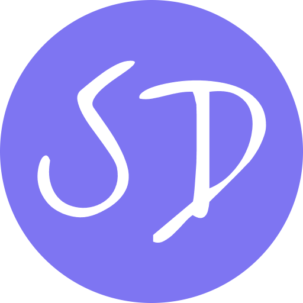

#  StarDrive

<p align="center">
  
  <a href="https://hosted.weblate.org/engage/stardrive/">
    
  </a>
</p>

StarDrive 是一个基于 [NiceGUI](https://github.com/zauberzeug/nicegui) 构建的云盘系统，支持多后端存储，并提供完善的文件管理功能。

StarDrive is a cloud drive system built on the [NiceGUI](https://github.com/zauberzeug/nicegui) library, featuring multi-backend storage support and comprehensive file management capabilities.

> [!WARNING]
> **本项目仍在开发中，尚未发布正式版本。**
> StarDrive 尚未经过充分测试，可能包含未知的 Bug 或安全漏洞。**请勿将其用于存储重要数据或在生产环境中使用。**
>
> **This project is under active development. No official release yet.**
> It may contain unknown bugs or security vulnerabilities. **Please DO NOT use it for sensitive data or in production.**

---

## 技术栈 (Tech Stack)

StarDrive 采用了现代化的 Python 技术栈：

* **Python 3.12+**
* **NiceGUI** (FastAPI, Vue 3, Quasar, Tailwind CSS 4)
* **SQLModel** - 数据库 ORM
* **PyJWT** - 身份认证
* **uv** - 现代 Python 包管理工具

## 快速开始 (Quick Start)

本项目使用 `uv` 进行依赖管理。

1.  **安装 uv**:
    ```shell
    curl -LsSf https://astral.sh/uv/install.sh | sh
    ```
2.  **创建本地配置并生成密钥**:
    ```shell
    cp .env.example .env
    openssl rand -hex 32
    # 将输出填入 .env 的 STARDRIVE_APP_SECRET
    ```
3.  **安装依赖并运行**:
    ```shell
    uv sync
    uv run -m app.main
    ```

容器部署同样要求设置稳定的 `STARDRIVE_APP_SECRET`。可将其写入未提交的 `.env`，然后执行
`docker compose up -d`。容器健康检查和编排系统可访问 `GET /api/healthz`；该接口不需要登录，
只返回服务状态和版本。

### 数据库升级与备份

启动时会自动执行 SQLite 数据库迁移。首次启动会创建数据库；升级旧版本时，StarDrive 会在
`app_data/db/` 中创建带 UTC 时间戳的 `local.db.bak.*` 备份，再标记并升级已识别的完整旧结构。
若发现不完整或未知的旧库，应用会拒绝启动以避免破坏数据：请先保留原库和备份，并使用以下命令
检查或执行迁移：

```shell
uv run alembic current
uv run alembic upgrade head
```

### 可选的外部集成验证

常规 CI 不需要云端凭据。若要在 push 后验证真实服务，请在 GitHub Actions Secrets 中配置专用、
可清理的 `STARDRIVE_TEST_OSS_*`（Region、Endpoint、Bucket、Access Key、Prefix）或
`STARDRIVE_TEST_SMTP_*`（Host、Port、Sender、Recipient，以及可选 TLS/账号/密码）。工作流只在
对应 Secrets 完整时运行，OSS 测试仅在指定 Prefix 下创建临时对象。

## 版本与 Docker 发布 (Versioning and Docker releases)

StarDrive 使用日历版本号（CalVer）。当前版本为 **`2026.6.23`**，格式为
`YYYY.M.D`；同一天的补发版本在末尾增加序号，例如 `2026.6.23.1`。版本仅在
`pyproject.toml` 中维护；已安装的发行包会从包元数据读取，源码运行时则读取同一份
`pyproject.toml` 元数据。

构建镜像时使用以下命令，它会同时生成 `qqays/stardrive:2026.6.23` 与
`qqays/stardrive:latest`，并为镜像写入 OCI 版本元数据：

```shell
python scripts/build_image.py
```

需要推送时附加 `--push`。`latest` 仅为便利标签；生产部署请固定使用日期版本，
例如 `qqays/stardrive:2026.6.23`，以保证部署可复现。

## 文件预览 (File Preview)

StarDrive 支持图片、视频、音频、PDF、文本/代码、Markdown、CSV/TSV 的在线预览。
Office 文档（如 doc/docx/xls/xlsx/ppt/pptx）会通过 LibreOffice 转换为 PDF 后预览。

Docker 镜像会内置 LibreOffice 和 Noto CJK 字体，以支持中文等 CJK 文档转换预览。
若你直接在本机运行 StarDrive 且未安装 LibreOffice，Office 文档会显示“不支持预览，
需要安装 LibreOffice”，不会影响其他格式预览。本机运行时如果中文显示为方框，
请安装可用的中文字体。

## 阿里云 OSS 后端

超级管理员可在“Console”中录入 OSS Region、endpoint、Bucket、AccessKey ID/Secret 和可选对象前缀，先执行连接校验，再切换当前存储后端。后端使用官方 `alibabacloud-oss-v2` SDK；SDK V2 默认采用 V4 签名，因此 Region 必填。凭据以应用的 `APP_SECRET` 派生密钥加密保存于本地数据库，生产环境必须设置足够强且稳定的 `APP_SECRET`。

启用 OSS 后，每位用户的数据位于 `可选前缀/users/{user_id}/`。文件上传、下载、预览与压缩下载均通过服务器流式代理；不会把 OSS 文件持久化到本地。Office 预览仅在单次请求中创建临时转换文件，并会在响应结束后删除。

给 AccessKey/RAM 用户授予所选 Bucket 的对象读写、列举、复制和删除权限，以及 Bucket 信息读取权限用于连接校验。切换本地与 OSS 后端不会自动迁移任一后端的既有文件。

## 翻译 (Translations)

我们使用 Weblate 管理多语言翻译。欢迎加入！

We use Weblate to manage translations. Contributions to new or existing languages are highly welcome!

[https://hosted.weblate.org/projects/stardrive/](https://hosted.weblate.org/projects/stardrive/)

[](https://hosted.weblate.org/engage/stardrive/)

## 贡献 (Contributing)

无论是修复 Bug、添加新功能还是改进文档，我们都欢迎您的贡献！

Whether it's fixing bugs, adding features, or improving docs, your help is appreciated!

* **指南 (Guide)**: 请阅读我们的 [CONTRIBUTING.md](./CONTRIBUTING.md) 以了解环境搭建、代码规范和 PR 流程。
* **问题反馈 (Issues)**: 发现问题？请通过 [GitHub Issues](https://github.com/qqAys/StarDrive/issues) 告知我们。

## 致谢 (Acknowledgments)

本项目基于 [NiceGUI](https://github.com/zauberzeug/nicegui) 的杰出工作：

> Schindler, F., & Trappe, R. NiceGUI: Web-based user interfaces with Python. The nice way. https://doi.org/10.5281/zenodo.7785516

感谢所有为本项目付出努力的贡献者！

## 许可 (License)

本项目遵循 [MIT](./LICENSE) 许可证。
